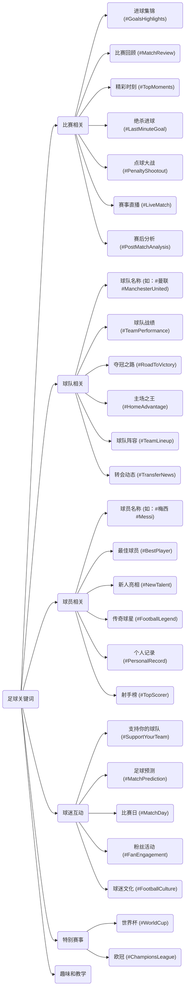

## 比赛相关

### 进球集锦 (#GoalsHighlights)

highlight goals soccer

highlight soccer video

highlight soccer video songs

highlight soccer example

highlight soccer players

### 比赛回顾 (#MatchReview)

soccer match review

soccer review

soccer review trend

soccer review for you

soccer review girl

### 精彩时刻 (#TopMoments)

top soccer moments of all time

top soccer moments

top soccer moments without music

top soccer respect moments

top 5 soccer fan moments

### 绝杀进球 (#LastMinuteGoal)

last minute goal

last minute goals in soccer

last minute goal reaction

last minute goal celebration

last minute goal fc 25

### 点球大战 (#PenaltyShootout)

PenaltyShootout

Penalty Shootout

penalty shootout meme

penalty shootout world cup final 2022

penalty shootout winners

### 赛事直播 (#LiveMatch)

live match soccer

live soccer match today

live soccer match real madrid

soccer matches on live

live match soccer barca

### 赛后分析 (#PostMatchAnalysis)

tactical analysis soccer

soccer analysis

soccer analysis striker

soccer analysis goal

soccer analysis today

## 球队相关

### 球队名称 (如：#曼联 #ManchesterUnited)

### 球队战绩 (#TeamPerformance)

### 夺冠之路 (#RoadToVictory)

### 主场之王 (#HomeAdvantage)

### 球队阵容 (#TeamLineup)

### 转会动态 (#TransferNews)

## 球员相关

### 球员名称 (如：#梅西 #Messi)

### 最佳球员 (#BestPlayer)

### 新人亮相 (#NewTalent)

### 传奇球星 (#FootballLegend)

### 个人记录 (#PersonalRecord)

### 射手榜 (#TopScorer)

## 球迷互动

### 支持你的球队 (#SupportYourTeam)

### 足球预测 (#MatchPrediction)

### 比赛日 (#MatchDay)

### 粉丝活动 (#FanEngagement)

### 球迷文化 (#FootballCulture)

## 特别赛事

### 世界杯 (#WorldCup)

### 欧冠 (#ChampionsLeague)

- \#英超 (#PremierLeague)
- \#西甲 (#LaLiga)
- \#国家德比 (#ElClasico)

## 趣味和教学

- \#足球技巧 (#FootballSkills)
- \#历史经典比赛 (#ClassicMatches)
- \#街头足球 (#StreetFootball)
- \#足球装备推荐 (#FootballGear)

